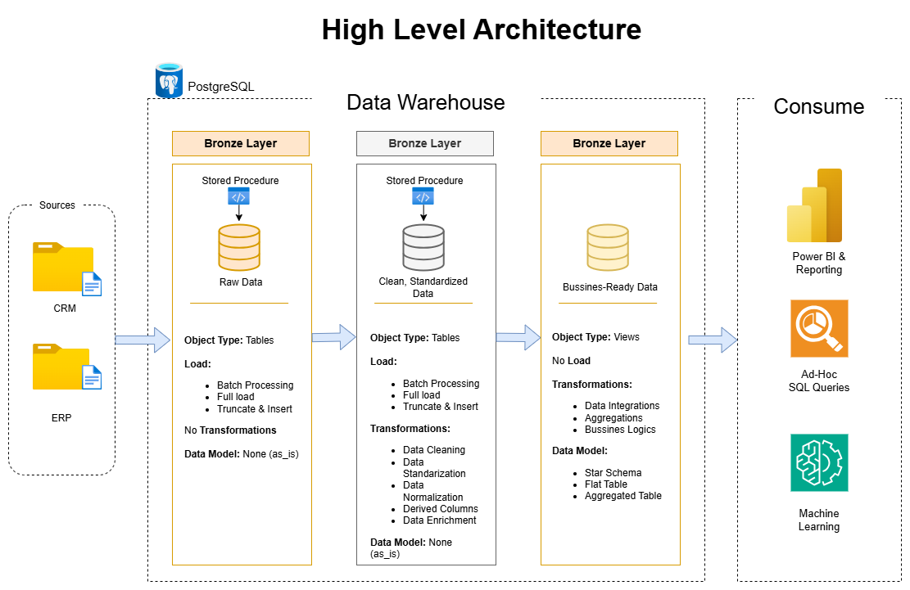
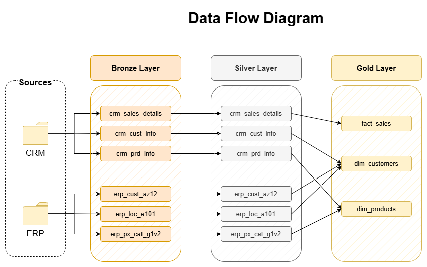

# 🏢 Data Warehouse Project (PostgreSQL)


## 📋 Project Overview
This project demonstrates the end-to-end creation of a modern **Data Warehouse** using **PostgreSQL**. The goal was to transform raw business data (CRM and ERP systems) into actionable insights using a **Medallion Architecture** (Bronze, Silver, and Gold layers).

The solution involves building ETL pipelines, data cleaning, data quality checks, and dimensional modeling (Star Schema) to support business analytics.

---

## 🏗️ Architecture & Workflow




The project follows a Multi-Layer Architecture...

### 1. 🥉 Bronze Layer (Raw Data)
* **Objective:** Ingest data "as-is" from source files (CSV) into the database.
* **Key Actions:**
    * Bulk data loading using the `COPY` command.
    * Preserved original formatting and headers to ensure full traceability.
    * High-performance truncation and insertion.

### 2. 🥈 Silver Layer (Cleansed & Standardized)
* **Objective:** Clean, normalize, and validate the data.
* **Key Actions:**
    * **Data Quality Checks:** Handling nulls, correcting negative values, and removing duplicates.
    * **Standardization:** Date formatting (`TO_DATE`), string trimming, and casting corrections.
    * **Logic Implementation:** Handling SCD (Slowly Changing Dimensions) logic for product history using `LEAD` window functions.
    * **Enriched Data:** Calculated derived columns for missing values.

### 3. 🥇 Gold Layer (Analytics & Reporting)
* **Objective:** Business-ready data modeled for BI tools.
* **Key Actions:**
    * Implemented a **Star Schema**.
    * Created **Dimensions** (`dim_customers`, `dim_products`) and **Fact Tables** (`fact_sales`).
    * Used SQL Views to present a user-friendly interface for reporting.

---

## 🛠️ Tech Stack
* **Database:** PostgreSQL 18.x
* **IDE:** JetBrains DataGrip
* **Language:** SQL (PL/pgSQL)
* **Version Control:** Git & GitHub
* **Key Concepts:** ETL, Data Modeling, Window Functions, Stored Procedures.

---

## 🚀 How to Run

1.  **Clone the repository:**
    ```bash
    git clone [https://github.com/LuasGit/sql-data-warehouse-project.git](https://github.com/LuasGit/sql-data-warehouse-project.git)
    ```
    *(Note: Ensure you have Git and PostgreSQL installed)*

2.  **Database Initialization:**
    Run the setup script to create the database and schemas:
    * `scripts/init_data_base.sql`

3.  **Create Tables (DDL):**
    Execute the DDL scripts for each layer to set up the table structures:
    * `scripts/bronze/ddl_bronze.sql`
    * `scripts/silver/ddl_silver.sql`
    * `scripts/gold/ddl_gold.sql`

4.  **Run ETL Procedures:**
    Execute the stored procedures to populate the tables:
    ```sql
    -- Load Bronze Layer
    CALL bronze.load_bronze();
    
    -- Load Silver Layer
    CALL silver.load_silver();
    ```

5.  **Analytics:**
    Query the Gold views to see the final results!

---
---

## 🇪🇸 Versión en Español

# Proyecto de Data Warehouse y Analítica

## 📋 Resumen del Proyecto
Este proyecto demuestra la creación de extremo a extremo de un **Data Warehouse** moderno utilizando **PostgreSQL**. El objetivo fue transformar datos crudos de negocio (sistemas CRM y ERP) en información útil utilizando una **Arquitectura Medallion** (capas Bronce, Plata y Oro).

La solución abarca la construcción de tuberías ETL, limpieza de datos, controles de calidad y modelado dimensional (Esquema Estrella) para soportar el análisis empresarial.

## 🏗️ Architecture & Workflow


The project follows a Multi-Layer Architecture...

### 1. 🥉 Capa Bronze (Datos Crudos)
* Ingesta de datos tal cual vienen de la fuente (archivos CSV).
* Uso del comando `COPY` para carga masiva y rápida.
* Preservación del formato original para trazabilidad.

### 2. 🥈 Capa Silver (Limpieza y Estandarización)
* **Calidad de Datos:** Manejo de valores nulos, corrección de valores negativos y eliminación de duplicados.
* **Estandarización:** Formateo de fechas, limpieza de textos y normalización de categorías.
* **Lógica de Negocio:** Implementación de lógica para dimensiones cambiantes (SCD) en productos históricos usando `LEAD`.

### 3. 🥇 Capa Gold (Analítica)
* Datos listos para el negocio modelados para herramientas de BI.
* Implementación de **Esquema Estrella**.
* Creación de **Dimensiones** (`dim_customers`, `dim_products`) y **Tabla de Hechos** (`fact_sales`) mediante Vistas SQL.

## 🚀 Instrucciones de Ejecución

1.  **Clonar el repositorio:**
    ```bash
    git clone [https://github.com/LuasGit/sql-data-warehouse-project.git](https://github.com/LuasGit/sql-data-warehouse-project.git)
    ```
    *(Nota: Asegurese que tenga Git y PostgreSQL instalados. )*

2.  **Inicialización de Base de Datos:**
    Ejecutar el script de configuración para crear la base de datos y los esquemas:
    * `scripts/init_data_base.sql`

3.  **Creación de Tablas (DDL):**
    Ejecutar los scripts DDL de cada capa para crear las estructuras de las tablas:
    * `scripts/bronze/ddl_bronze.sql`
    * `scripts/silver/ddl_silver.sql`
    * `scripts/gold/ddl_gold.sql`

4.  **Ejecutar ETL:**
    Ejecutar los procedimientos almacenados para poblar las tablas:
    ```sql
    CALL bronze.load_bronze();
    CALL silver.load_silver();
    ```
5. **Analisis:**
Haga correr las vistas (views) de la capa de Gold.

## 👤 Author / Autor
**Alberth Saul Mamani Pita**
* Student at Universidad Mayor de San Andrés (UMSA) - Computer Science.
* Focus: Data Engineering, Backend Development & SQL.
